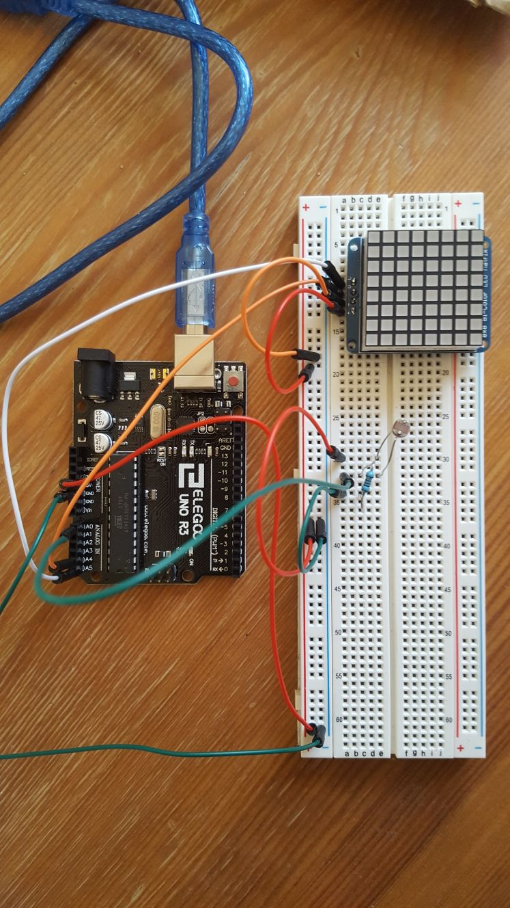
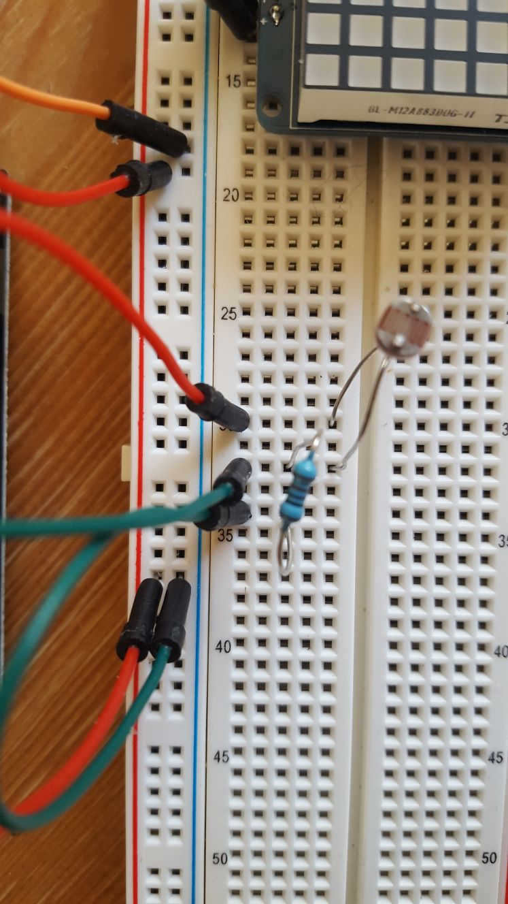

An simple Arduino script that runs an Ising model and displays the state of the simulation on an [Adafruit 8x8 LED matrix](https://www.adafruit.com/product/870). 

## Getting Started 

The script has been configured for use with the following setup:

* Arduino UNO 
* Adafruit 8x8 LED matrix 
* Photoresistor for controlling the temperature. 

You will need to install the Adafruit GFX and Adafruit LED backpack libraries which can be installed by the Arduino IDE. 

Wire up the LED matrix as follows: 

* 5V power to the pin labelled `+`.
* Ground to the pin labelled `-`. 
* Analog 5 (A5) to the pin labelled `D`.
* Analog 4 (A4) to the pin labelled `C`.

To run the temperature signal, run some power via a resistor and photoresistor to the A0 pin. The script has been calibrated with a 10K resistor, but can easily be adjusted.

The board is wired up as shown in the image below (circuit diagram will be uploaded soon):

